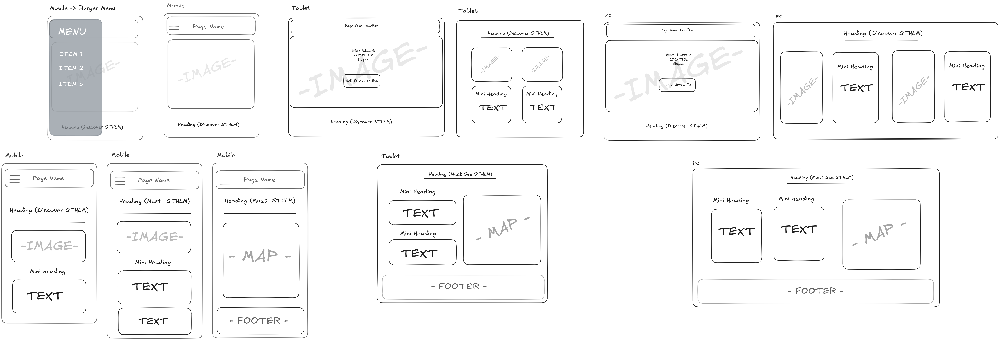

# Traveler - A Responsive Travel Webpage

## About

**Traveler** is a fully responsive webpage promoting Stockholm as a must-visit destination. It features a modern design built with **Tailwind CSS** and includes:

- A hero section highlighting Stockholm's charm.
- Informative sections like "Discover Stockholm" and "Must See in Stockholm."
- A footer with navigation links, and contact information.

## Features

1. **Hero Section**:

   - Full-width image with a welcome message and call-to-action button.

2. **Discover Stockholm**:

   - Highlights the charm of Stockholm's Old Town (**Gamla Stan**) and the interactive **ABBA Museum** with text and images.

3. **Must See in Stockholm**:

   - Informative cards with interactive descriptions and an embedded Google Map.

4. **Responsive Footer**:
   - Navigation links and contact details.

## Technologies Used

- **Tailwind CSS**: For responsive styling.
- **HTML5**: For semantic structure.
- **JavaScript**: For burger menu interaction.
- **Google Maps Embed API**: For the map feature.

## Wireframe

Below is the wireframe used to plan the layout of the webpage:



## How to Run

1. Clone the repository:
   ```bash
   git clone https://github.com/your-username/Traveler-Stockholm.git
   ```
2. Navigate to the project directory:
   ```bash
   cd Traveler-Stockholm
   ```
3. Install Dependencies
   ```bash
   npm install
   ```
4. Run Project
   ```bash
   npm run dev
   ```
5. Open your browser and navigate to local page
   ```bash
   http://localhost:5173/
   ```

## Author

Alex Saxena  
https://github.com/AlexSaxena
